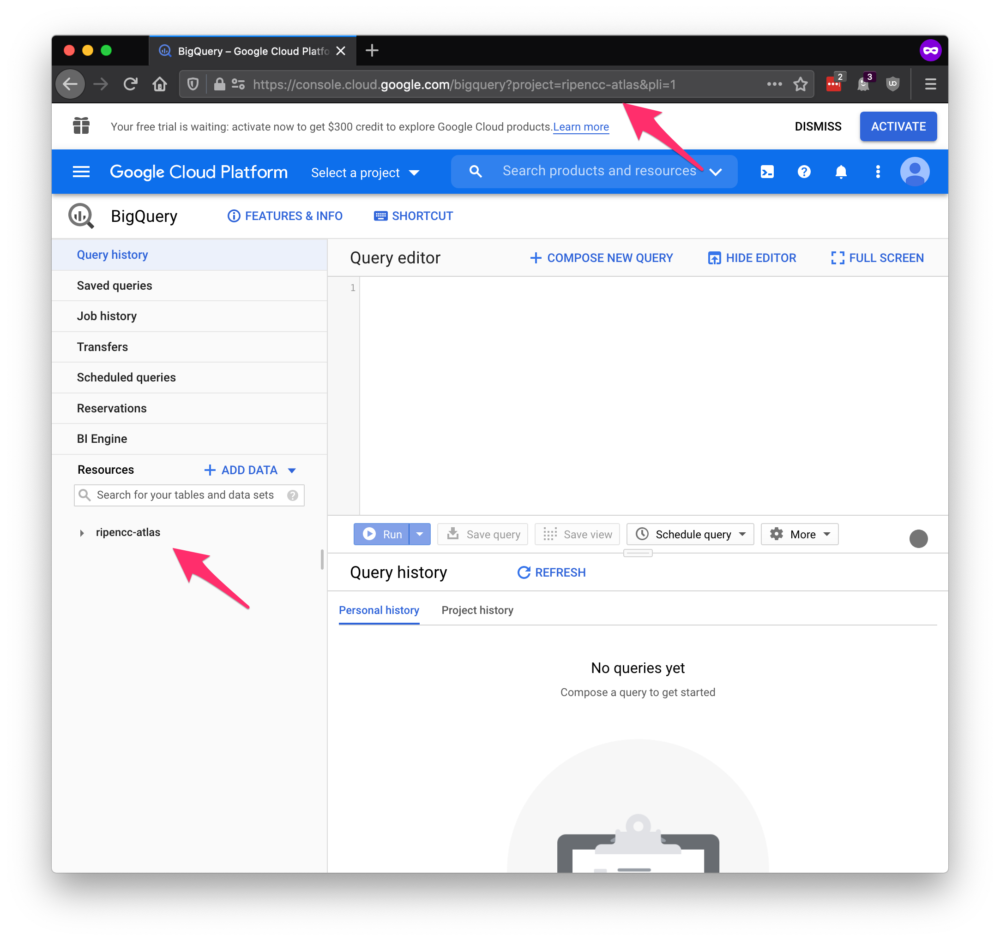
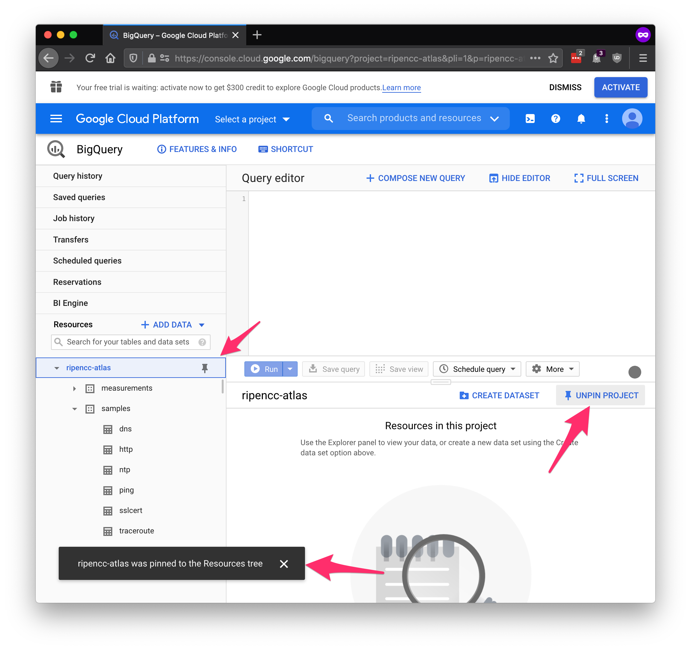
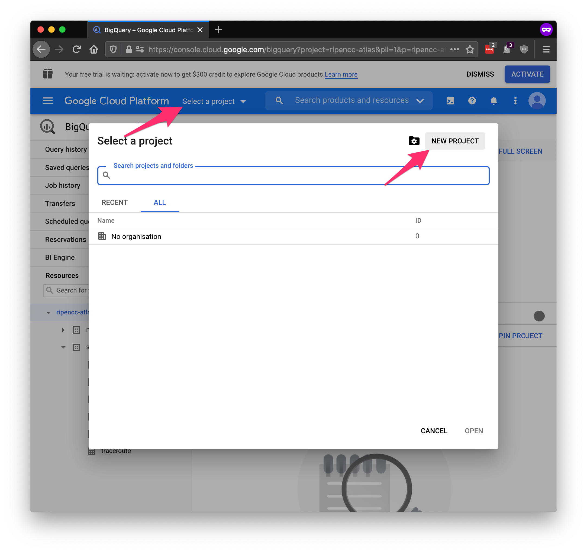
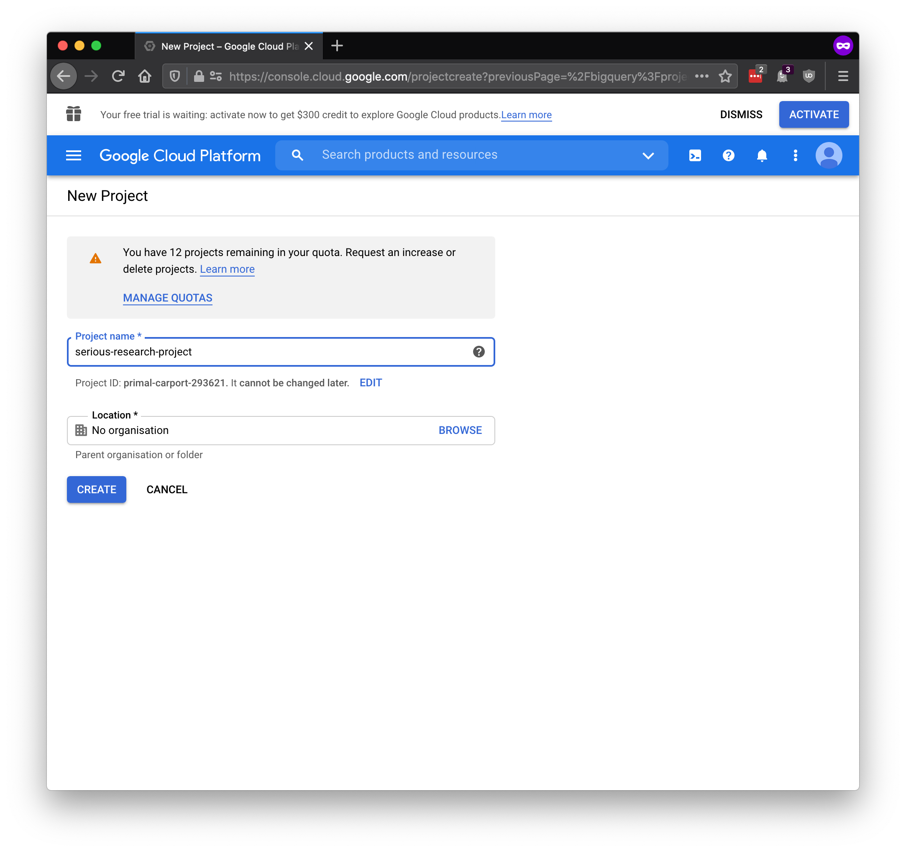
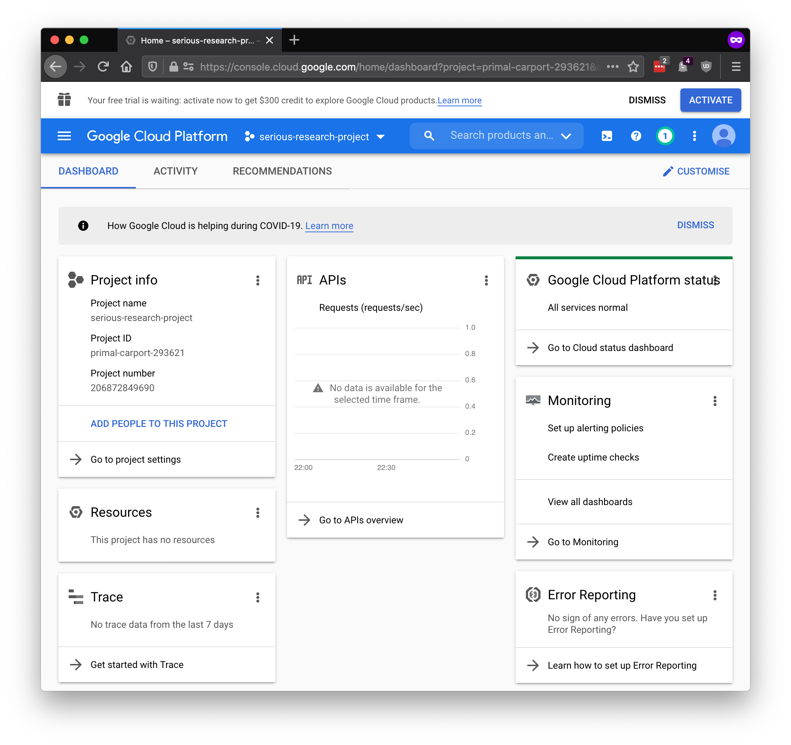
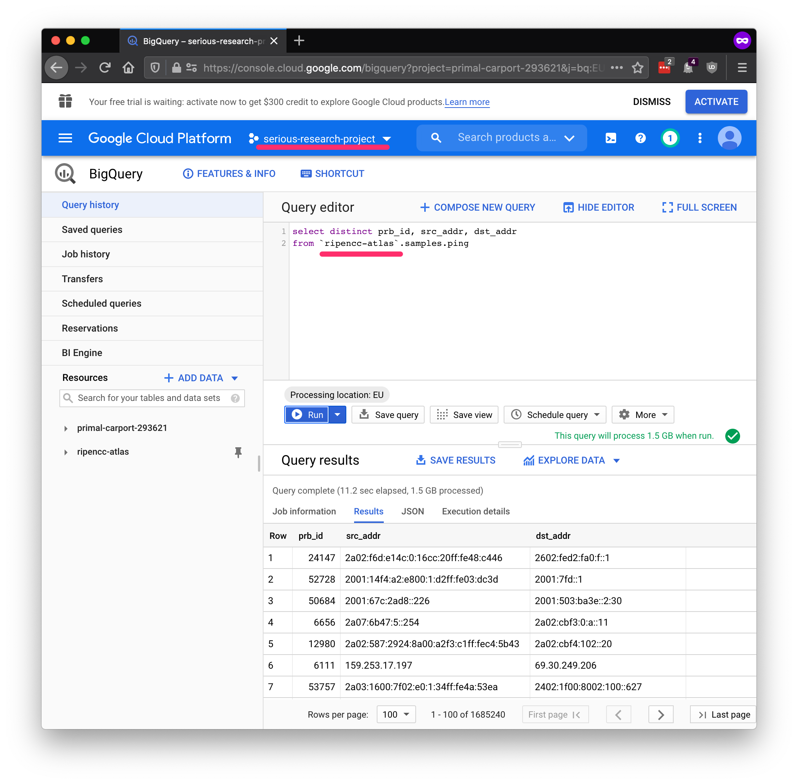

# Access

To gain access to this data via BigQuery, you'll need a Google account.

Once you have a Google account, you should be able to view the following page:

https://console.cloud.google.com/bigquery?project=ripencc-atlas

Once you're in, the console looks something like the following. Note that if
you're viewing the `ripencc-atlas` project by following the link above, then
the project will also appear in the `Resources` sidebar on the left.

It may not stay there by default, so pin it by selecting the project in the
sidebar, then tapping `pin project`:

That'll keep the `ripencc-atlas` project in your sidebar when you navigate the interface. 

## BigQuery Terminology: Projects, Datasets, and Tables

In BigQuery terminology, the following classifications are important:

* Projects
  * Datasets
    * Tables and Views

1. A project has users, it can contain multiple datasets, and it is the entity that costs are ultimately charged to.
2. A dataset can hold multiple tables.
3. A table is what stores the actual data. A view can often be treated like a table; it's backed by a real table, but relies on a query to calculate its contents.

You're going to need a project under which to run queries. Enter the `Select a project` menu at the top, and you'll see this:

Go ahead and select `New project`, and give your project a name:

Once this is done, you'll be thrown to the main console for your project. From
here you can manage everything: users, permissions, billing, and any other
Google Cloud Platform service you start using. For now, go to the search bar
and find BigQuery to get back to the query console.

Having done all of that, you now have:

* Pinned our public project, and
* Created your own project to run queries under.

Note that unless you've clicked around further, you've not yet added any
billing information. You'll max out after 1TB of queries on the free tier. But
that's enough to try things out:

## Datasets

Our public project is `ripencc-atlas`, and the datasets are `measurements`
(with six views) and `samples` (with six tables). From a usage standpoint, the
difference between views and tables is barely relevant, but views are computed
from other tables. These views give us control on what the tables look like
publicly.

Each of the views in `measurements` holds some historical data, and is populated with
streaming data soon after it is delivered by the probes. The tables in `samples`
are populated with 1% of one week of data for each measurement type.

## Costs

We're managing the storage of this data, and the trade-off is that we can't
absorb the costs of all users running querie, just as we can't absorb the
cost of running a custom platform to do the same thing. Google will charge
you to query this data.

The cost of querying data is directly related to how much data must be
retrieved from storage. The amount of computation performed over that data
once it's retrieved is not relevant to pricing. Our measurements tables are
partitioned by the field

 * start_time

at daily granularities. You can always constrain costs by reducing the time
window that you are querying with this column. You can read more on
optimising costs on [this page](tutorial_cost_efficiency.md).

Note that there's a baseline free-level: it's possible to query up to 1TB free
per month, but also note that it's very easy to query 1TB of data! For
testing and prototyping, please consider using the `samples` dataset we
make available alongside `measurements`.

In addition to the free tier, new users get US$300 to spend on the
platform, and that'll get you a little further: closer to 50-60TB of queries
depending on current pricing.

Users at educational institutions ought to investigate the Google For Education
program: https://edu.google.com/programs/

You can read more about query pricing here: https://cloud.google.com/bigquery/pricing#queries

